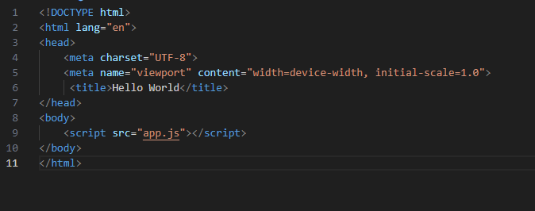
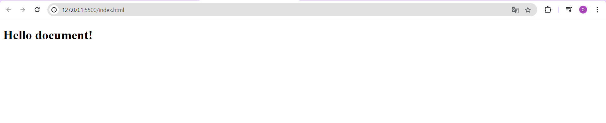
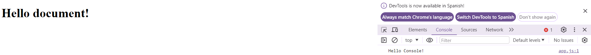
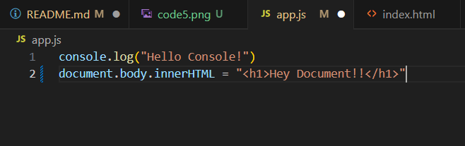
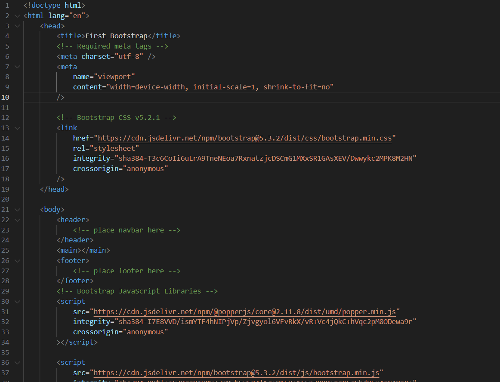
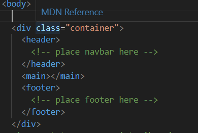
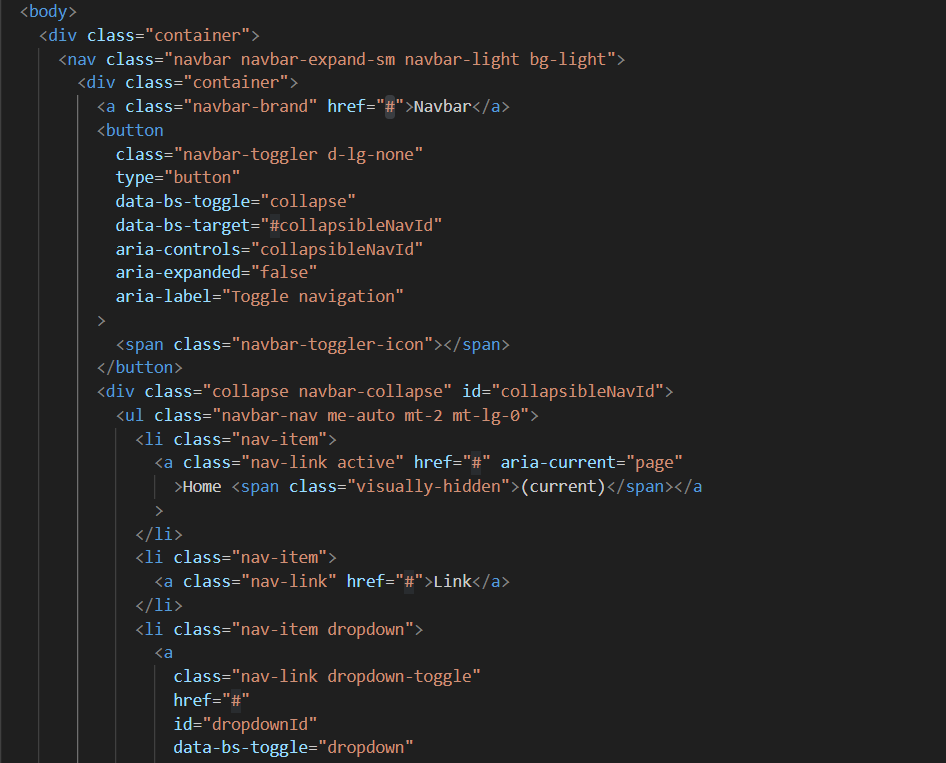
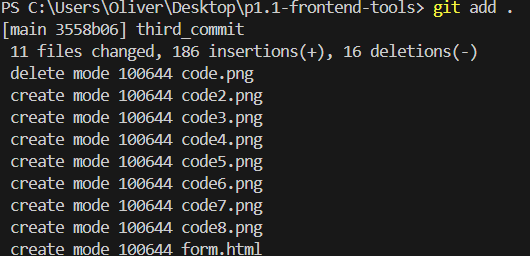
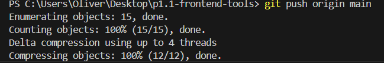

# Practice 1.1 - Installing and configuring Web Development Tools

### 2DAW - DWEC Bilingual. 

> **Student Name**:  Óliver García Rodríguez

#### Files included in this repository:

Ennumerate and explain each one of the files included in this repo.

- File 1
- File 2
- Etc...

#### Instructions: 

- Fill your name and lastname and answer the questions in the current `README.md` file. You have to submit the activity as a GitHub repo link that has to include the 

- You can add images to this tocument with the syntax:

    ```md
    
    ```

- Any other question about Markdown language you can find in the [Markdown Cheat Sheet](https://www.markdownguide.org/cheat-sheet/)

### Section 1: Install and configure VSCode

1. **Install `VSCode` in your computer**.
2. **Create a new folder called `p1.1-frontend-tools`and open it as a workspace in VSCode. Copy the current `README.md` inside it**.
3. **What functionalities do the following VSCode extensions add?**
   - **Bootstrap 5 quick Snippets** : It's a sort of guide for fast development when you're coding with bootstrap framework.
   - Let's say you want to use a background color but you don't really remember how it is and instead of visiting the documentation 
   - for bootstrap, the snippet will help you if you remember a little bit (like okay, background color... maybe I can try
   - with bg)
   - **Live Server** : Lets you launch a local server so you can see the changes done in real time.
   - **Prettier** : Used for automatically format your code in a consistent style so it is more readable and clean
   - **Markdown All in One** : To simplify and enrich the experience when you're writing or editing a markdown document.
4. **Install the extensions listed in the previous point in VSCode**. Done
5. **What other extensions do you know that you consider interesting for developing in JavaScript**?
   Coderunner, especially because this summer I was doing a JavaScript roadmap and my editor was VSC so when I wanted to run the code,
   I could not find any run code botton.
   Did my research and found a couple that may be interesting:
   ESLint, to find errors or bugs in your code when you're typing in JS.
   ImportCost, tells you the size that libraries you import have, it's very useful because we're working on FrontEnd so we don't really want
   to have a over-megabyted web.
6. **Find in VSCode the option in `Settings` to `Format On Save` and activate it. What effect has this option?** 
   Whenever you save the code or you go out of the code editor, VSC will format it for you so you don't have to do it manually

### Section 2: Create a Hello World in JS

7. **Create an `index.html` file inside your worspace folder.**
8. **Create the basic html structure using the `!` snippet and change the title to 'Hello World'**

    ````html
    <!DOCTYPE html>
    <html lang="en">
    <head>
      <meta charset="UTF-8">
      <meta name="viewport" content="width=device-width, initial-scale=1.0">
      <title>Hello World</title>
    </head>
    <body>
      
    </body>
    </html>
    ````

9. **Create a new file called `app.js` and add this two lines**

    ````javascript
    console.log("Hello Console!")
    document.body.innerHTML = "<h1>Hello document!<h1>"
    ````

10. **Import the script in your html using one of the techniques explained in class. Explain here the technique, show the code and justify why did you choose this technique**.
    
    

    Tried to put the script tag at the bottom of the head but it didn't work so instead I placed it at the end of the body.
    I did my research and could be because app.js is loading before DOM (Document Object Model), so when the script is trying to modify the document.body.innerHTML, page's body is not ready yet

11. **Launch `index.html` in Live Server and check that the script is running. Click right button and select inspect to show the developer tools and take a look on the console.**
    
    
    
    
12. **Change some message in the JS code and sava changes. You can check that Live Server refreshes the web page.**

    
    

### Section 3: Create a simple form with Bootstrap 4. 

13. **At this point, we are going to create a page called `form.html` starting from the `Bs5-$` template provided by the Bootstrap extension we added. What files does this template import in the html by default?**
    
    

    We have the head and body like a simple HTML have. The most important changes we can see is that the head is related to the bootstrap-dedicated
    css and then at the end of the body the script that refers to the js app.
    
14. **Create a `<div>`with the class `.container` to wrap all the sections in the web page**
    
    
  
15. **Add a standard navigation bar inside the nav area using the `bs5-navbar-standard` snippet inside the container**
    
    

    Did it like you told but makes more sense to me to place it in the header

16. **Inside the main area create a form using Bootstrap to collect data from a new user who wants to register at an academy that offers courses. We can copy code from [Bootstrap Documentation](https://getbootstrap.com/docs/5.0/forms/overview/)**. 
    
    

### Section 4: Install Git, and upload your project to GitHub

1.  **Install [git](https://git-scm.com/) in your computer**.
    Done
2.  **Init the git project**
   Done
    
3.  **Log in to your GitHub account provided by IES Azarquiel**
   Done
    
4.  **Follow the teacher on GitHub at the following link: [https://github.com/jeatzr/](https://github.com/jeatzr/)**
   Done
    
5.  **Create a new empty project on GitHub named `p1.1-frontend-tools`.**
   Done
    
6.  **Follow the instructions in the command line provided by GitHub to add your files, create the first commit and push it. Notice that in out case we have to add all files to the staged area with `git add .`, not just`git add README.md`** 




    
7.  **To finish, submit the link of your GH repo to the task in our Classroom.**
   Done